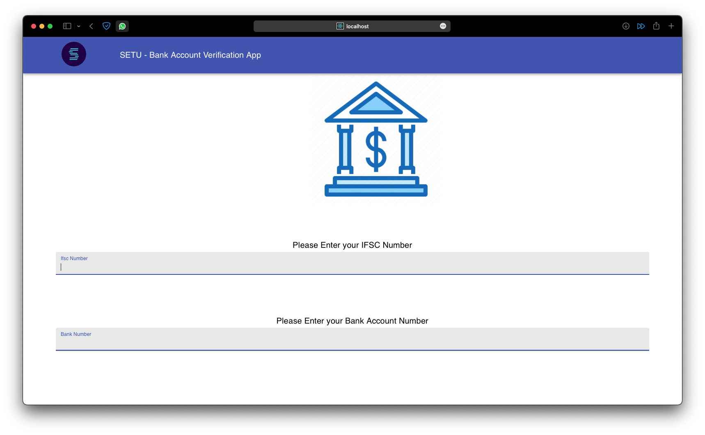

## PAN Verification APP
 

### Note : You need to setup both Frontend(ReactJS) and Backend(Django) for this App to work  

## To setup React Frontend (can use NPM or YARN)
In the project directory, you can run :

#### `npm i`
#### `npm start`

Runs the app in the development mode.
Open [http://localhost:3000](http://localhost:3000) to view it in the browser.

## To setup Backend
In the project directory, you can run:

#### `pip install -r requirements.txt`
#### `python3 makemigrations`
#### `python3 migrate`
#### `python3 manage.py runserver`

Runs the app in the development mode.
API ENDPOINT : [http://127.0.0.1:8000/panverify/](http://127.0.0.1:8000/panverify/)

<h2><strong>Sample Design</strong></h2>
 
 
 